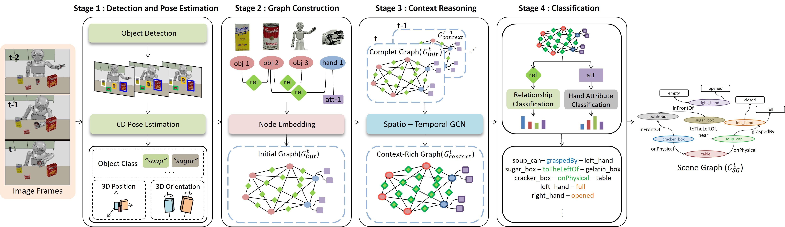

# SG4RMT
Journal of Institute of Control, Robotics and System(ICROS)

[Dynamic 3D Scene Graph Generation for Robotic Manipulation Tasks](https://www.dbpia.co.kr/journal/articleDetail?nodeId=NODE10671832)

- - -

## Model

## Keywords
- 3D Scene Graph Generation
- Spatio-Temporal Context Reasoning
- Graph Convolutional Network

## Video Demo
* Input Video

* Scene Graph

 

* gg
<left></left>
<right></right>

